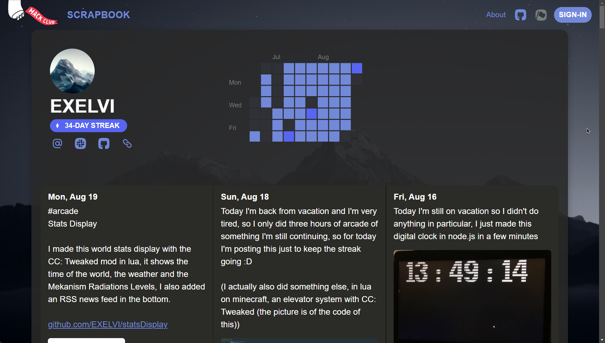

# [📓 Scrapbook Custom CSS](https://scrapbook.hackclub.com/EXELVI)



[](https://github.com/EXELVI/scrapbookCustomCSS/issues)
[](https://github.com/EXELVI/scrapbookCustomCSS/stargazers)
[](https://github.com/EXELVI/scrapbookCustomCSS/network)

Enhance your [Hack Club Scrapbook](https://scrapbook.hackclub.com) with custom CSS to personalize your content and stand out from the crowd!

### [🌐 My scrapbook](https://scrapbook.hackclub.com/EXELVI)


## 🚀 Features

- 🎨 **Custom Styling:** Add a unique look to your Scrapbook with custom CSS.
- 💻 **Easy Integration:** Apply the CSS with a simple Slack command.
- 🔧 **Fully Customizable:** Modify the CSS to fit your exact needs.


## 📖 How to Use

To apply this custom CSS to your Hack Club Scrapbook, follow these steps:

1. **Open Slack:** Navigate to your Hack Club Slack workspace.
2. **Run the Command:** Copy and paste the following command into any Slack channel:

   ```bash
   /scrappy-setcss https://raw.githubusercontent.com/EXELVI/scrapbookCustomCSS/main/style.css
    ```

3. Enjoy Your New Look: Visit your [Scrapbook](https://scrapbook.hackclub.com/) to see the new style in action!

## 🛠️ Customization
Feel free to modify the style.css file in this repository to better match your personal style. Simply fork the repository, make your changes, and use the updated CSS link in the /scrappy-setcss command.

## 🌟 Contributions
Contributions are welcome! If you have any ideas, suggestions, or bug reports, please open an issue or submit a pull request.